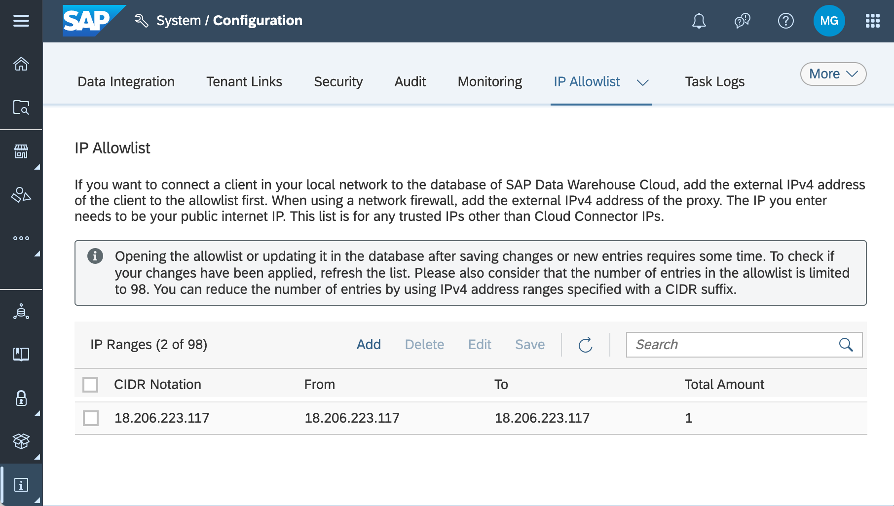

# SAP Data Warehouse Cloud Provisioner

[](https://api.reuse.software/info/github.com/SAP-samples/dwc-provisioner)

## Description
This sample tool provides an example of how to programmatically create, update, and delete SAP Data Warehouse Cloud artifacts. The tool, referred to as **provisioner**, is written in Python and demonstrates how to automate various SAP Data Warehouse Cloud provisioning activities. The **provisioner** can perform the following actions against SAP Data Warehouse Cloud tenants:

- create and remove spaces with a simplified command line
- bulk create and remove spaces using a CSV file
- create and remove connections in one, or many spaces
- create and remove shared objects from one space to another
- create scripts of multiple commands
- generate a HANA tables for monitoring and analytics

The syntax for **provisioner** commands can be found [here](commands.md).
## Requirements
Before installing and running the **provisioner**, the following configurations and 3rd party components must be available.

**Required**

- SAP Data Warehouse Cloud administrator access, i.e., user with <span style="color: green">**DW&nbsp;Administrator**</span> privilege
- [Python version 3.8](https://www.python.org/downloads "Download") or higher

**Optional**

- [Git (latest version)](https://git.com "Download")
- Access to an SAP HANA (on-prem or cloud) schema

## Check the Environment

To ensure success running this tool, please use the following steps to validate the software requirements.

**Python**

The **provisioner** tool requires Python 3.8 (or higher) to be available.  Use the following command to verify the Python installation.

> <span style="color: gray">_Note_: the latest versions of Python include both <span style="color: white">_python_</span> and <span style="color: white">_python3_</span> versions of the command to start Python.</span>

```
ubuntu@ip-17-1-3-11:~$ python --version
Python 3.10.4
ubuntu@ip-17-1-3-11:~$
```

**Git**

To retrieve the **provisioner** from GitHub, the command line version of Git is an easy way to download the project to a local directory. The project may also be downloaded from GitHub as a zip file using a browser.

```
C:\>git --version
git version 2.37.0.windows.1
C:\>
```

## Download

Clone or download this repository to a directory. In all the examples in this README, a sub-directory named "tools" will be used as the starting location for all operations.

The commands to download the project are similar for all major operating systems, i.e., Linux, Windows, and Mac OS X.

**GitHub Download**

The **provisioner** is available on the SAP-samples Github repository: [DWC Provisioner](https://github.com/SAP-samples/dwc-provisioner).  The tool can be downloaded as a zip file from Github or the tool can be cloned directly from Github using one of the following commands.

_Ubuntu / Linux_:

From the home directory of the user _ubuntu_:
```bash
ubuntu@myhostname:~$ mkdir tools
ubuntu@myhostname:~$ cd tools
ubuntu@myhostname:~/tools$ git clone https://github.com/SAP-samples/dwc-provisioner
```

_Windows_

Open a command window (cmd):
```bash
c:\> mkdir c:\tools
c:\> cd c:\tools
c:\> git clone https://github.com/SAP-samples/dwc-provisioner
Cloning into 'dwc-provisioner'...
```
_MacOS_

From a terminal session:
```bash
myuser@mymachine ~ % mkdir tools
myuser@mymachine ~ % cd tools
myuser@mymachine tools % git clone https://github.com/SAP-samples/dwc-provisioner
Cloning into 'dwc-provisioner'...
myuser@mymachine tools % 
```

**Browser Download**

Using a browser, navigate to the SAP-samples/dwc-provisioner repository and click the "Download ZIP" button.  Save or move the ZIP file to the "tools" sub-directory and unzip the contents.


## Optional Python setup
Python allows you to create "virtual environments" to help manage dependencies between installed packages and the versions of packages used in a specific project.  <span style="font-weight: bold; color: green">It is a best practice</span> to create a virtual environment for each project.  Without a virtual enviroment, all Python packages are installed in the "global" space and all projects share the same package versions.

> https://packaging.python.org/en/latest/guides/installing-using-pip-and-virtual-environments/

### Install the Python virtual environment tool.

The Python virtual environment tool uses the typical Python installation process, i.e., pip.

_Ubuntu_
```bash
sudo apt install python3-venv
```
_Windows/MacOS_
```
python -m pip install --user virtualenv
```
### Configure a virtual environment
Python virtual environments must be explicity created and activated.  The following command create a Python virtural environment in the dwc-provisioner directory.

<pre>
ubuntu@ip-17-1-83-11:~/tools$ cd dwc-provisioner
ubuntu@ip-17-1-83-11:~/tools/dwc-provisioner$ python3 -m venv .venv
</pre>

### Activate the virtual environment
Python virtual enviroments must be activated each time in a command/terminal window before using Python.

_Ubuntu / Linux / Mac OS_

Non-windows platforms activate the virtual enviroment by "sourcing in" the necessary enviroment to the current shell.

```bash
ubuntu@ip-17-1-83-11:~/tools/provisioner$ source .venv/bin/activate
(.venv) ubuntu@ip-17-1-83-11:~/tools/provisioner$ 
```

> **Note**: the the (.venv) prefix has been added to the command line prompt.

_Windows_

Windows activates the virtual enviroment by executing a batch script.

```bat
c:\devpath\dwc-provisioning> .venv\scripts\activate
```

If the environment is activated correctly, a previx (.venv) is shown in the command line:
```bat
(.venv) c:\devpath\dwc-provisioning>
```

## Install Python packages

The **provisioner** requires publically available Python packages to be installed before running the tool.  The packages are quickly installed using the following command:

```bat
(.venv) c:\tools\dwc-provisioner> python -m pip install -r requirements/core.txt
```

## Configure HANA (optional)

To create and store information about SAP Data Warehouse Cloud in an SAP HANA Cloud instance, ensure the IP address where this tool runs is in the allow list for SAP HANA Cloud connections.  In the example below, an SAP Data Warehouse Cloud Data Access User (a.k.a., hash-tag (#) user) is the target, so in SAP Data Warehouse Cloud set the IP Allow list under the System / Configuration tab.



## Provisioner Configuration
To start using the **provisioner**, a configuration file is created to identify the target SAP Data Warehouse Cloud tenant and set the username and password values.

Refer to the following sections on command syntax for additional information on the `config` command.

```
c:\> cd tools\dwc-provisioner

c:\> .venv\scripts\activate

(.venv) c:\tools\dwc-provisioner> provisioner config
  --dwc-url https://{your-tenant}.{ds}.hcs.cloud.sap
  --dwc-user user.name@domain.com
  --dwc-password NotYourPassword!
```
> **Notes**:
> 
>1. Command options are listed on separate lines for clarity.
>2. The change directory and starting the Python virtual environment commands are included for completeness.

## Uninstall

To uninstall simply remove the dwc-provisioner directory, including all sub-directories

## Known Issues

This sample application is in an early stage of development, so:
- don't store personal information because of missing access logging
- don't store sensitive information because there is no access control
- don't use the example application productively because users and passwords generated by the **config** command, while obfuscated, are not securely encrypted.
- don't expect always meaningful error messages in reaction to erroneous input.

## How to obtain support

This an example application not supported by SAP. However, you can 
[create an issue](https://github.com/SAP-samples/dwc-provisioner/issues) in this repository if you find a bug or have questions about the content.

## Contributing

If you wish to contribute code, offer fixes or improvements, please send a pull request. Due to legal reasons, contributors will be asked to accept a DCO when they create the first pull request to this project. This happens in an automated fashion during the submission process. SAP uses [the standard DCO text of the Linux Foundation](https://developercertificate.org/).

## Code of Conduct

see [here](CODE_OF_CONDUCT.md)

## License

Copyright (c) 2022 SAP SE or an SAP affiliate company. All rights reserved. This project is licensed under the Apache Software License, version 2.0 except as noted otherwise in the [LICENSE](LICENSE) file.
